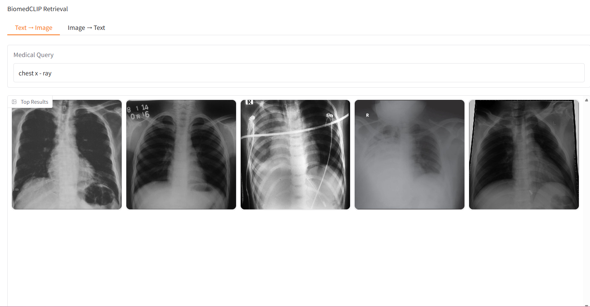

# BiomedCLIP Fine-Tuning en ROCO

Modelo BiomedCLIP ajustado (fine-tuning) sobre el conjunto de datos **ROCO (Radiology Objects in Context)** para tareas de recuperación multimodal imagen-texto en el dominio radiológico.

## Descripción

Este proyecto realiza el ajuste fino de **BiomedCLIP**, un modelo fundacional multimodal para imágenes biomédicas y texto científico, utilizando pares imagen-caption del subconjunto de radiología de ROCO.

El modelo resultante mejora la alineación entre imágenes médicas y descripciones clínicas, permitiendo:

- Búsqueda de imágenes a partir de texto.
- Recuperación de descripciones médicas a partir de imágenes.
---

## Demo

Prueba el modelo directamente desde Hugging Face Spaces:

**[Acceder a la demo](https://huggingface.co/spaces/lulu12lemon/biomedclip)**


## Modelo Base
Se utilizó:

- **BiomedCLIP**
- Encoder de imágenes: ViT-B/16
- Encoder de texto: PubMedBERT
- Framework: OpenCLIP

Más información sobre BiomedCLIP:

https://huggingface.co/microsoft/BiomedCLIP-PubMedBERT_256-vit_base_patch16_224

---

## Dataset

### ROCO (Radiology Objects in Context)

ROCO es un conjunto de datos de visión por computadora médica compuesto por imágenes extraídas de publicaciones biomédicas junto con sus respectivas descripciones. Por motivos de licencia y tamaño, las imágenes originales no se incluyen en este repositorio. Se usó la data a partir de Kaggle  **[Acceder al dataset]([https://huggingface.co/spaces/lulu12lemon/biomedclip](https://www.kaggle.com/datasets/virajbagal/roco-dataset))**
Sin embargo, se proporciona el archivo:

```text
radiologytraindata_clean.csv
```
---

## Estructura del Proyecto

```text

├── notebooks/
├───── TA_Final.ipynb
├── scripts/
├───── script.py
├───── script2.py
├───── script3.py
├── data/
├───── Trainingdataset.py
├───── radiologytestdata_clean.csv
├── demo/
├───── app.py
├── requirements.txt
└── README.md
```

Donde:

| Archivo | Descripción |
|----------|------------|
| `script_final.py` | Entrenamiento del modelo con parámetros optimizados |
| `app.py` | Aplicación Gradio |
| `requirements.txt` | Dependencias del proyecto |

Además, el modelo final puede ser encontrado **[aquí]( https://huggingface.co/spaces/lulu12lemon/biomedclip/blob/main/model.pt)**

---

## Instalación

### 1. Clonar el repositorio

```bash
git clone https://github.com/sunset0917/biomedclip-roco-finetuning.git
```

### 2. Crear entorno virtual

```bash
python -m venv venv
```

Linux/Mac:

```bash
source venv/bin/activate
```

Windows:

```bash
venv\Scripts\activate
```

### 3. Instalar dependencias

```bash
pip install -r requirements.txt
```

---

## Aplicación Gradio

Primero descargar el modelo **[aquí]( https://huggingface.co/spaces/lulu12lemon/biomedclip/blob/main/model.pt)**
Nota: Para la demo, como parte de las imágenes para recuperar y mostrar se usó el test set del dataset ROCO. 
Ejecutar localmente:

```bash
python app.py
```

La interfaz permite:

- Describir una imagen radiológica.
- Buscar imágenes radiológicas a partir de texto.
- Visualizar resultados ordenados por relevancia.


---

## Resultados

Se muestran los resultados obtenidos para el modelo propio.

| Tarea | Métrica | Modelo Propio | BioMedCLIP |
|----------|---------|---------|---------|
| Recuperación Imagen a Texto | Recall@1 | 33.55% | 33.21% |
| Recuperación Imagen a Texto| Recall@5 | 66.27% | 66.02% |
| Recuperación Imagen a Texto | Recall@10 | 79.40% | 79.26% |
| Recuperación Texto a Imagen | Recall@1 | 35.60% | 35.49% |
| Recuperación Texto a Imagen | Recall@5 | 66.96% | 67.09%
| Recuperación Texto a Imagen | Recall@10 | 80.31% | 80.14%


---


### Interfaz de la Demo



---

## Limitaciones

Este proyecto tiene fines exclusivamente académicos y de investigación. Además, se ha enfocado en el desarrollo de tarea de recuperación de texto e imágenes del modelo de BiomedCLIP, no se han implementado las tareas de clasificación de imágenes o respuesta de preguntas. 

---


---

## 📄 Licencia

Este proyecto se distribuye bajo la licencia que el autor considere apropiada (MIT, Apache 2.0, etc.).
